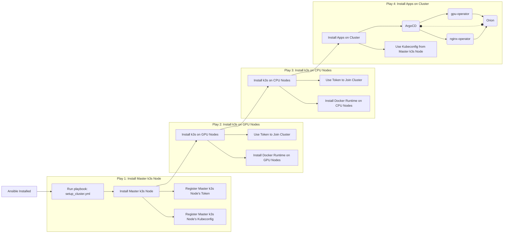

# Orion Cluster Playbooks

This repository provides tooling to bootstrap a kubernetes cluster and Orion prerequisites.
While it exists as a self contained execution environment, it provides an example of how you could interface with various aspects of the Ansible role to in order to customize your site's deployment and maintenance requirements.

It aims to reduce [Orion](https://juno-fx.github.io/Orion-Documentation/) site deployment cycle time.

## Scope
- Tooling to deploy supporting infrastructure for running a production Orion deployment on your own VMs or metal nodes.
- Ansible role consisting of multiple feature capabilities for deploying supporting infrastructure.
- Accompanying example playbook of a full deployment using the role.

## Contents

- `inventory.yml` - [customize this!] Ansible inventory file defining cluster nodes
- `orion_vars.yml` - [customize this!] High level variables for the Orion deployment
---
- `setup_cluster.yml` [example playbook]- Main Ansible playbook
- `install_dependencies.yml` - Ansible playbook to provide localhost requirements so that you can use `deploy.sh`
- `roles/` - Contains the Orion role and its tasks
---
- `install_dependencies.sh` - Local requirements setup script.
- `deploy.sh` - Ready to use deployment script





## Prerequisites

Before deploying the Orion cluster supporting infrastructure, ensure that you have the following prerequisites:

- 3+ Linux nodes with SSH access to use as k8s nodes
- Python and pip installed on the host machine
- Ansible installed via `pip install -r requirements.txt`
- Access to Orion images for use in deployment
- gpu-operator argocd app definition

Once you have Python, pip, and Ansible set up, run the `./setup.sh` script to install the necessary dependencies on your localhost. This will provide:
- `kubectl` to confirm your cluster installation and begin admin
- `k3sup` to set up the remote host as a k8s cluster member

## Usage

1. Update the `inventory.yml` file with your server details
2. Modify `orion_vars.yml` with your specific configuration
3. Run the deployment:
   ```bash
   ./deploy.sh
   ```
4. If `install_argocd` is enabled, you can access it by visiting one of your nodes: `http://<node-ip>:{{ argocd_nodeport_port }}`.  Open the `./argo-password` file, and use the password within as well as username `admin`.  If this service sample does not satisfy your needs, feel free to edit in `role/orion/templates/argocd_service.yml.j2`

## Example Usage Scenarios

### 1. Full Cluster Deployment

```yaml
# Execute full cluster setup
./deploy.sh
```

### 2. GPU Node Addition

```yaml
# Add new GPU nodes to existing cluster
./deploy.sh --limit k3s_cluster_gpu_agents
```

## Configuration
1. **inventory.yml**
   - Define your cluster nodes
   - Group nodes by type (server, CPU agents, GPU agents)

2. **orion_vars.yml**
   - Override default variables
   - Set environment-specific configurations

### Common Configuration Scenarios

> All below examples are editing `orion_vars.yml`

- **Custom Docker Registry**
   
   When you set your docker image repository credentials, it enables a secret in the cluster of which you can refer to in your app deployments. 
   ```yaml
   docker_registry: "registry.yourorg.com"
   docker_registry_username: "your-username"
   docker_registry_password: "your-password"
   ```

- **Modified K3s Installation:**
    
    Override the k3s_install_args to define the right k3s deployment args for your site.
   ```yaml
   k3s_install_args: |
     --disable servicelb
     --disable traefik
     --node-taint key=value:NoSchedule
   k3s_force_reinstall: true
   ```

- **Deploy Orion and other apps during installation:**
    ```yaml
    install_argocd_apps:
        - "/path/to/orion/production-argocd-application.yml"
        - "/your/other/app.yml"
    ```

- **Provide ArgoCD private git prefix credentials**

    By providing these vars, it enables setting argocd with the credentials required for accessing git repositories at your private site.  Once these are provided, any git repository with the given prefix is able to be pulled by argocd.

    ```yaml
    argocd_git_repo_prefix: https://github.com/YourOrg/
    argocd_git_token_name: your-token-name
    argocd_git_token: ghp_TokenValuesB52b52B52b52
    ```

- **Provide Alternate KUBECONFIG location**
    
    To override the location of the cluster's output kubeconfig yaml file. 
    ```yaml
    k3s_kubeconfig_path: /your/desired/cluster/kubeconfig/file.yml
    ```

- Further examples are available inside `orion_vars.yml`
